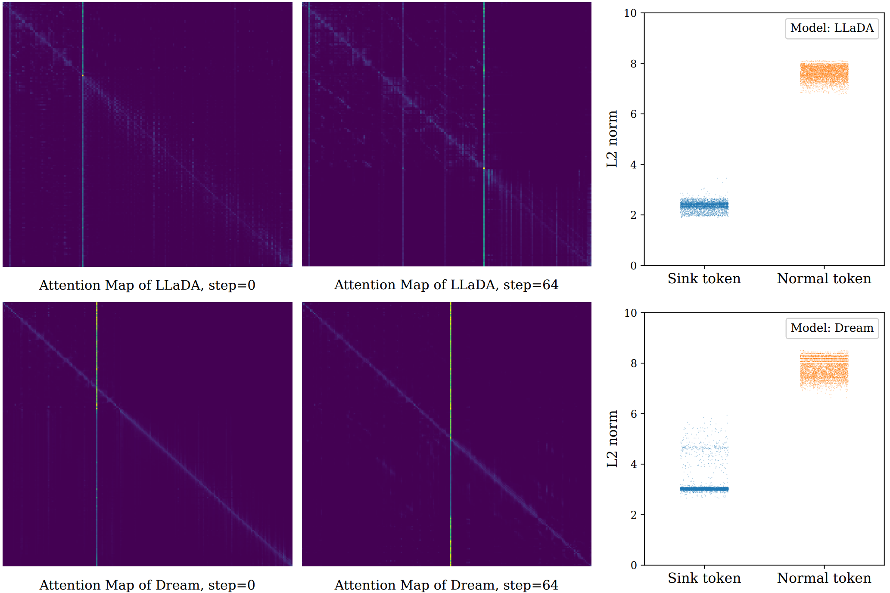

# One Token Is Enough: Improving Diffusion Language Models with a Sink Token

Diffusion Language Models (DLMs) have emerged as a compelling alternative to autoregressive approaches, enabling parallel text generation with competitive performance. Despite these advantages, there is a critical instability in DLMs: the moving sink phenomenon. Our analysis indicates that sink tokens exhibit low-norm representations in the Transformer's value space, and that the moving sink phenomenon serves as a protective mechanism in DLMs to prevent excessive information mixing. However, their unpredictable positions across diffusion steps undermine inference robustness. To resolve this, we propose a simple but effective extra sink token implemented via a modified attention mask.
Specifically, we introduce a special token constrained to attend solely to itself, while remaining globally visible to all other tokens. 
Experimental results demonstrate that introducing a single extra token stabilizes attention sinks, substantially improving model performance. Crucially, further analysis confirms that the effectiveness of this token is independent of its  position and characterized by negligible semantic  content, validating its role as a robust and dedicated structural sink.


<div style="display: flex; justify-content: center; flex-wrap: wrap;">
    
    
</div>

## News
Our [paper](https://arxiv.org/abs/2601.19657) is available!

Code for training DLM form scratch(based on [SMDM](https://github.com/ML-GSAI/SMDM)) now released!

## Dependency
We can build the Anaconda environment based on [SMDM](https://github.com/ML-GSAI/SMDM). 

## Pretrain
Please first prepare dataset following [SMDM](https://github.com/ML-GSAI/SMDM).


### Pretrain DLMs
```sh
# e.g., 472M(0.5B) non-embedding parameters MDM and 300e18 training FLOPs, 8 GPUs
lightning run model \
    --node-rank=0  \
    --accelerator=cuda \
    --devices=8 \
    --num-nodes=1 \
    pretrain/train_mdm.py --model 472 --flops 300.
```


### Pretrain DLMs with element-wise Gated Attention
```sh
# e.g., 472M original non-embedding parameters + extra param for Gated Attention, same training tokens
lightning run model \
    --node-rank=0  \
    --accelerator=cuda \
    --devices=8 \
    --num-nodes=1 \
    pretrain/train_mdm.py --model 472 --flops 300.
```

### Pretrain DLMs with extra token
```sh
lightning run model \
    --node-rank=0  \
    --accelerator=cuda \
    --devices=8 \
    --num-nodes=1 \
    pretrain/train_mdm.py --model 472 --flops 300.
```

## Evaluate DLMs after Pretraining

### Commonsense reasoning and reading comprehension
We use the famous [lm-evaluation-harness](https://github.com/EleutherAI/lm-evaluation-harness) framework for evaluation.


#### MDMs pretrained on the SlimPajama dataset

**Please make sure the modeling file in the evaluation package has been switched to the corresponding mode (diffmodel.py,diffmodel_extratoken.py,diffmodel_gate.py)!!!**

We provide the running commands in `eval_mdm.sh`, `eval_mdm_gate.sh` and `eval_mdm_extratoken.sh`.


## Supervised fine-tuning
### Math reasoning
Please download the augmented training [data](https://github.com/da03/implicit_chain_of_thought/blob/main/data/gsm8k/train.txt) and
put the `train.txt` file in `./data/gsm8k`.
```angular2html
lightning run model \
    --node-rank=0  \
    --accelerator=cuda \
    --devices=8 \
    --num-nodes=1 \
    sft/finetune_mdm_gsm8k.py --model 472 --pretrain_path yourpathtosavemodel
```

```angular2html
lightning run model \
    --node-rank=0  \
    --accelerator=cuda \
    --devices=8 \
    --num-nodes=1 \
    sft/finetune_mdm_gsm8k_gate.py --model 472 --pretrain_path yourpathtosavemodel
```

```angular2html
lightning run model \
    --node-rank=0  \
    --accelerator=cuda \
    --devices=8 \
    --num-nodes=1 \
    sft/finetune_mdm_gsm8k_extratoken.py --model 472 --pretrain_path yourpathtosavemodel
```


### Math reasoning
Please download the GSM8K test [data](https://github.com/hao-ai-lab/Consistency_LLM/blob/main/eval/gsm8k/test.jsonl)
and put the `test.jsonl` into `./data/gsm8k`
```angular2html
python evaluate_gsm8k.py --ckpt_path "your_path_to_sftmodel"
```
```angular2html
python evaluate_gsm8k_gate.py --ckpt_path "your_path_to_sftmodel"
```
```angular2html
python evaluate_gsm8k_extratoken.py --ckpt_path "your_path_to_sftmodel"
```


